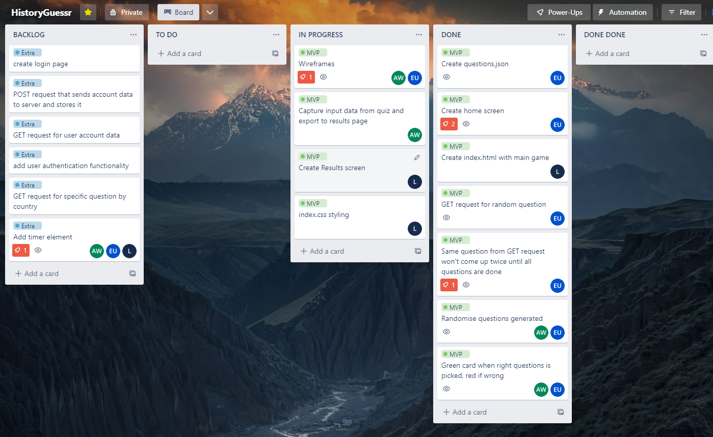
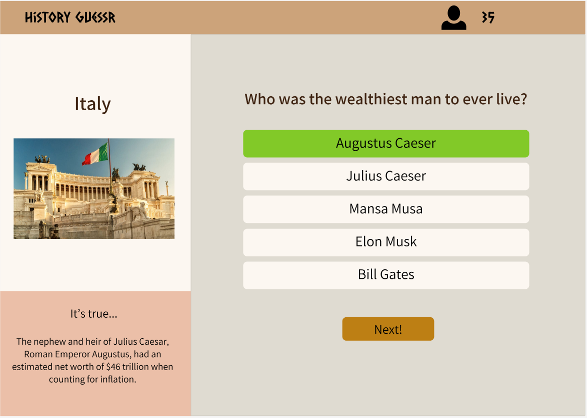

# History Guessr
  
A multiple choice game built for students in schools, with a focus on non-STEM subjects including History.


## Installation and Usage

## Installation
1. Clone repo using ``` git clone ``` followed by either **HTTPS** or **SSH** link of the repo from [Github](https://github.com)
2. Inside the root, server and client directories run ``` npm init ``` to install all required dependencies


## Usage
1. Open terminal in the root directory
2. Run ``` npm run server ``` to start the server *OR* ``` npm run dev ``` in the server directory to run it using **nodemon** 
3. Navigate into the client directory and run ``` npm run dev ``` then use live server in VSCode or double click on index.html


## Technologies
* [HTML](https://developer.mozilla.org/en-US/docs/Web/HTML)
* [CSS](https://developer.mozilla.org/en-US/docs/Web/CSS)
* [Javascript](https://www.javascript.com)
* [Node.js](https://nodejs.org/en/)
* [Express.js](https://expressjs.com)


## Process
1. Started by making a kanban board of the product backlog and wireframes for different pages of the website. 
   
2. Created a server API with Express.js and Node.js to send random questions from a JSON file down to the client  
```Javascript
let number = Math.floor(Math.random() * questions.length);
res.status(200).send(questions[number]);
next();
```
3. Created client side quiz page with the game's functionality using a function to fetch data from the API server 
```Javascript
const data = await fetch ("http://localhost:4000/questions/random");
const allData = await data.json();

const answers = Object.entries(allData.answers);

const p = document.createElement('p');
p.classList.add("answers");
p.innerText = ans[1];

answersDiv.appendChild(p);
```
4. Created results page to display the results of the game, data passed in from quiz to results page using local storage
```Javascript
userResponse.push({
    question: allData.question, 
    answerSelected: ans[1],
    correctAnswer: allData.answers.right
});

userResponse = JSON.parse(localStorage["responseData"]);
userScore = JSON.parse(localStorage["score"]);
```
5. Created home screen with button to begin the game

## Wins & Challenges
### Wins
* Made sure GET request returning random question does not return same question twice
* Made sure that the player cannot click on more than one answer before moving on to next question
* Made a homepage with a 3D rotating pictures gallery.
### Challenges
* Getting results of questions answered to transfer to the results page
* Making a timer function that would go to next question if player did not respond in time (was not implemented)
* Trying to make the game responsive on multiple devices


## Bugs 
* More than one question loads at the start of the game for a split second


## Future features
* Responsivness for mobile and smaller screen sizes
* Different game modes
* Time functionality
* User accounts and authentication 


## License


